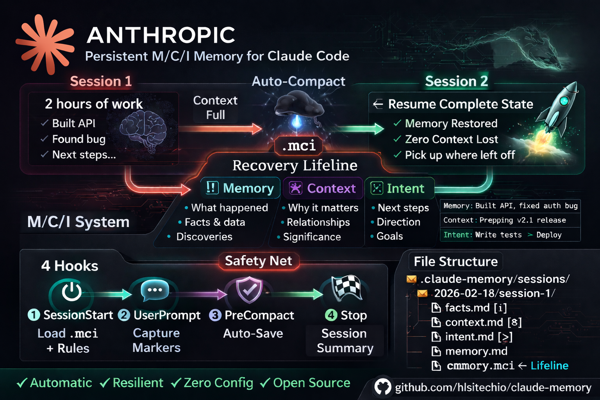

<h1 align="center">🧠 claude-memory</h1>

<p align="center">
  
</p>

<p align="center">
  <strong>Persistent memory for Claude Code sessions using the M/C/I system.</strong><br>
  <em>Survives compacts, crashes, restarts, and even weekends.</em>
</p>

<p align="center">
  <a href="#-quick-start"></a>
  <a href="#-quick-start"></a>
  <a href="#-how-it-works"></a>
  <a href="#%EF%B8%8F-safety-net--recovery"></a>
  <a href="LICENSE"></a>
</p>

<p align="center">
  
  
  
  
</p>

---

> 🚨 **The problem:** Claude Code starts every session blank. When the context window fills up, auto-compact fires and your conversation history is compressed. Terminal crash? **Complete amnesia.**
>
> ✅ **The fix:** `claude-memory` — a hook-based system that automatically saves and restores your working state across sessions, compacts, crashes, and restarts.

---

## 🔄 How It Works

### 😵 The Problem

```
Session 1: You build something complex over 2 hours
            ↓ context fills up
            ↓ auto-compact fires 💥
Session 1 (continued): Claude forgot everything 🤷
            ↓ terminal crashes
Session 2: Total amnesia. "What were we working on?" 😶
```

### 💡 The Solution: state.md (v2)

**v2** introduces `state.md` — a **living document** that Claude actively maintains:

```markdown
# Session State
> Last updated: 14:30

## Goal
Build the user authentication system with JWT tokens

## Progress
- [x] Set up database schema
- [x] Implement login endpoint
- [ ] Add token refresh logic
- [ ] Write integration tests

## Findings
- Auth middleware needs to handle expired tokens gracefully
- Rate limiting should be per-user, not per-IP
```

**Why this works:** state.md lives on **disk**, not in context. When auto-compact fires, state.md is untouched. Claude reads it back and picks up exactly where it left off.

### 📦 M/C/I Triplets (Safety Net)

Every piece of state is also backed up as an **M/C/I triplet** in `.mci`:

| Component | What it captures |
|-----------|-----------------|
| 📝 **Memory** | Goal — what you're working on |
| 🔗 **Context** | Progress — what's done, what's next |
| 🎯 **Intent** | Findings — discoveries and important data |

### ⚡ Four hooks automate the lifecycle:

```
┌─────────────────────────────────────────────────────────┐
│ 🟢 SessionStart                                         │
│    → Creates/resumes session + state.md template         │
│    → Loads last .mci (cascades up to 7 days back)        │
│    → Detects crashes & recovers automatically            │
│    → First-run: copies templates, onboards Claude        │
├─────────────────────────────────────────────────────────┤
│ 🔵 UserPromptSubmit (every prompt)                       │
│    → Checks state.md health (exists? updated?)           │
│    → Auto-checkpoints state.md every ~10 prompts         │
│    → Estimates context usage & warns before compact ⚠️   │
│    → Captures legacy markers as backup                   │
├─────────────────────────────────────────────────────────┤
│ 🟠 PreCompact (before auto-compact)                      │
│    → Snapshots FULL state.md content to .mci             │
│    → 3-tier fallback: state.md → markers → JSONL         │
│    → Creates conversation backup 💾                      │
├─────────────────────────────────────────────────────────┤
│ 🔴 Stop (session end)                                    │
│    → Snapshots state.md to .mci                          │
│    → Generates session summary 📊                        │
└─────────────────────────────────────────────────────────┘
```

---

## 🚀 Quick Start

### 🔌 Option A: Plugin Install (Recommended)

The fastest way — native Claude Code plugin with automatic hook registration:

```bash
# Add the marketplace (one-time)
/plugin marketplace add hlsitechio/claude-memory

# Install the plugin
/plugin install claude-memory@hlsitechio
```

That's it! Restart Claude Code and memory is active. On first run, the plugin:

1. 📂 Creates `.claude-memory/sessions/` directory
2. 📄 Creates `state.md` — your living state file
3. 📄 Copies `IDENTITY.md` and `PREFERENCES.md` templates to your project
4. 🧠 Injects v2 rules so Claude understands state.md immediately
5. 💬 Guides Claude through a first-run welcome message

You also get **3 slash commands**:

| Command | What it does |
|---------|-------------|
| 🔖 `/claude-memory:save` | Manual checkpoint — save state to `.mci` right now |
| 🔁 `/claude-memory:recall` | Load and display last saved M/C/I state |
| 📊 `/claude-memory:status` | Dashboard — state.md health, .mci entries, session info |

**Updating:**
```bash
/plugin marketplace update hlsitechio
/plugin update claude-memory@hlsitechio
```

### 📦 Option B: Manual Install (git clone)

For full control or if you want to customize the hooks:

```bash
git clone https://github.com/hlsitechio/claude-memory.git
cd claude-memory
./install.sh /path/to/your/project
```

The installer will:
1. 📂 Copy 4 hook scripts to your project's `.claude/hooks/`
2. 📄 Install `CLAUDE.md` with v2 rules
3. ⚙️ Generate `.claude/settings.local.json` with hook configuration
4. 🗂️ Create the `.claude-memory/sessions/` directory
5. 🎭 Optionally install identity templates (`IDENTITY.md`, `PREFERENCES.md`)

### 📋 Prerequisites

| Requirement | Plugin | Manual |
|------------|--------|--------|
| 🤖 Claude Code | v2.1+ | v2.1+ |
| 📦 Node.js | ✅ (bundled with Claude Code) | Not needed |
| 🔧 jq + bash | Not needed | Required |

---

## 🛡️ Safety Net & Recovery

### 📝 state.md — Primary Recovery

state.md is your **primary recovery mechanism**. It lives on disk, completely outside the context window. When compact fires:

1. Pre-compact hook snapshots state.md → .mci (automatic)
2. Anthropic's black box compact compresses the conversation
3. SessionStart fires, tells Claude: "Read state.md"
4. Claude reads Goal/Progress/Findings and resumes work

**No data loss. No "what were we doing?" No amnesia.**

### 💥 Crash Recovery

If the terminal crashes (Stop hook never fires):

1. **On next startup**, SessionStart detects the crash (no end marker)
2. **Loads the .mci** from the crashed session
3. **state.md is still on disk** — full state preserved
4. **Injects a CRASH RECOVERY block** telling Claude what happened
5. Claude resumes — **no questions asked**

### ⏱️ Auto-Checkpoint (Crash Insurance)

Every **~10 prompts**, the hook auto-snapshots state.md to `.mci`. Even if Claude never manually saved and the terminal crashes, there's recent state.

### 📅 7-Day .mci Cascade

When loading memory, SessionStart searches:
```
current session .mci
  → previous session (timed out)
    → earlier sessions today
      → yesterday → ... → up to 7 days back
```

### 🥇🥈🥉 3-Tier Fallback (PreCompact)

| Tier | Source | When |
|------|--------|------|
| 🥇 **Best** | state.md snapshot | state.md exists and has content (>200 bytes) |
| 🥈 **Good** | Assembled from marker files | Legacy markers captured, no state.md |
| 🥉 **Emergency** | Extracted from JSONL transcript | Nothing else available |

---

## 🏷️ Markers

In v2, markers are primarily **display formatting**. The real memory lives in state.md.

### 📝 state.md Actions (v2 primary)

| Marker | Display | state.md Action |
|--------|---------|----------------|
| ✅ `[+]` | Success | (display only) |
| ❌ `[-]` | Failed | (display only) |
| 🔴 `[!]` | Critical | → Edit Findings section |
| 🟢 `[>]` | Next step | → Edit Progress section |
| 🟡 `[*]` | Context | → Edit Goal section |
| 🔵 `[i]` | Info | → Append to memory.md |

### 🔄 Legacy Capture (automatic backup)

The prompt-capture hook still watches for markers in Claude's responses and auto-saves them to facts.md/context.md/intent.md. This is backward compatibility — state.md is primary.

### 📌 Example

When Claude writes:
```
[!] Found that the API rate limit can be bypassed by rotating User-Agent headers
```

**v2 behavior:** Claude should also Edit the Findings section of state.md.
**Legacy backup:** The hook auto-captures it to facts.md.

---

## 📦 The .mci File

The `.mci` file is auto-generated by hooks as a **safety net**:

```
--- [PC] state.md Snapshot @ 14:30:00 ---
Memory: GOAL: Build the user filtering API with pagination support
Context: PROGRESS: - [x] Database schema designed\n- [x] GET endpoint working\n- [ ] Add filters
Intent: FINDINGS: Auth bypass found in middleware — blocks release until fixed
```

> 🛡️ In v2, you rarely need to think about .mci. The hooks handle it automatically by snapshotting state.md.

---

## 📁 Session Structure

```
.claude-memory/
├── current-session          ← pointer to active session
└── 📂 sessions/
    └── 📂 2026-02-20/
        ├── 📂 session-1/
        │   ├── 📝 state.md           ← YOUR EXTERNAL BRAIN (v2 primary)
        │   ├── 📄 facts.md           ← 🔴 [!] legacy backup
        │   ├── 📄 context.md         ← 🟡 [*] legacy backup
        │   ├── 📄 intent.md          ← 🟢 [>] legacy backup
        │   ├── 📄 memory.md          ← 🔵 [i] entries + session log
        │   ├── 🛡️ memory.mci         ← auto-generated safety net
        │   ├── 💾 compact-*.md       ← conversation backups
        │   └── 📊 session-summary.md ← tool stats, files modified
        └── 📂 session-2/
            └── ...
```

---

## ⚙️ Configuration

### 🔌 Plugin Hooks (automatic)

Plugin hooks are configured automatically via `hooks.json`. No manual setup needed.

<details>
<summary>📋 Click to see plugin hooks.json</summary>

```json
{
  "hooks": {
    "SessionStart": [
      {
        "matcher": "startup|clear|compact",
        "hooks": [{ "type": "command", "command": "node \"${CLAUDE_PLUGIN_ROOT}/scripts/session-start.js\"", "timeout": 30 }]
      }
    ],
    "UserPromptSubmit": [
      {
        "matcher": "",
        "hooks": [{ "type": "command", "command": "node \"${CLAUDE_PLUGIN_ROOT}/scripts/prompt-capture.js\"", "timeout": 5 }]
      }
    ],
    "PreCompact": [
      {
        "matcher": "",
        "hooks": [{ "type": "command", "command": "node \"${CLAUDE_PLUGIN_ROOT}/scripts/pre-compact.js\"", "timeout": 30 }]
      }
    ],
    "Stop": [
      {
        "matcher": "",
        "hooks": [{ "type": "command", "command": "node \"${CLAUDE_PLUGIN_ROOT}/scripts/session-stop.js\"", "timeout": 30 }]
      }
    ]
  }
}
```

</details>

### 🪝 Manual Hook Settings

For git-clone installs, the installer generates `.claude/settings.local.json`:

<details>
<summary>📋 Click to expand manual hook configuration</summary>

```json
{
  "hooks": {
    "SessionStart": [
      { "matcher": "", "hooks": [{ "type": "command", "command": "bash \"$CLAUDE_PROJECT_DIR/.claude/hooks/session-start.sh\"" }] }
    ],
    "UserPromptSubmit": [
      { "matcher": "", "hooks": [{ "type": "command", "command": "bash \"$CLAUDE_PROJECT_DIR/.claude/hooks/prompt-capture.sh\"", "timeout": 5 }] }
    ],
    "PreCompact": [
      { "matcher": "", "hooks": [{ "type": "command", "command": "bash \"$CLAUDE_PROJECT_DIR/.claude/hooks/pre-compact.sh\"" }] }
    ],
    "Stop": [
      { "matcher": "", "hooks": [{ "type": "command", "command": "bash \"$CLAUDE_PROJECT_DIR/.claude/hooks/session-stop.sh\"", "timeout": 30 }] }
    ]
  }
}
```

</details>

### 🎛️ Tunable Constants

| Constant | Default | Purpose |
|----------|---------|---------|
| `RESUME_TIMEOUT` | `14400` (4 hours) | Seconds before creating a new session |
| `MCI_LOOKBACK_DAYS` | `7` | Days to search back for .mci recovery |
| `AUTO_CHECKPOINT_INTERVAL` | `10` | Prompts between auto-checkpoints |
| `CONTEXT_LIMIT` | `1000000` | Estimated JSONL bytes at compact |
| `WARN_BYTES` | `700000` | ~70% — gentle checkpoint reminder |
| `CRITICAL_BYTES` | `850000` | ~85% — strong save warning |
| `EMERGENCY_BYTES` | `950000` | ~95% — save NOW |

### 🎭 Identity Templates (Optional)

| Template | Purpose |
|----------|---------|
| 📝 `IDENTITY.md` | Personality and principles (system prompt addition) |
| ⚡ `PREFERENCES.md` | Output style and communication preferences |

---

## ❓ FAQ

<details>
<summary>🆕 What changed in v2?</summary>

v1 used 4 append-only marker files (facts.md, context.md, intent.md, memory.md). The pre-compact hook only grabbed the LAST line from each file — losing everything else. Marker compliance was 3 entries in 45 sessions because the contract was too complex.

v2 replaces this with a single `state.md` file that Claude actively maintains using the Edit tool. Pre-compact snapshots the FULL content. No data loss. No complex marker contracts. Just keep one file current.
</details>

<details>
<summary>🤖 Does this work with Claude Code subagents?</summary>

The hooks run on the main session. Subagents don't trigger hooks directly, but the main session's state.md captures the overall flow.
</details>

<details>
<summary>📊 How much context does this use?</summary>

SessionStart injects ~500-800 tokens (identity + .mci + rules). This is a small fraction of the ~200K token context window.
</details>

<details>
<summary>💥 What if my terminal crashes?</summary>

state.md is on disk — it survives crashes. On next startup, SessionStart detects the crash, loads the .mci + state.md, and injects a CRASH RECOVERY block. Auto-checkpoints every ~10 prompts ensure .mci is also recent.
</details>

<details>
<summary>📅 What if I come back after the weekend?</summary>

The .mci cascade searches up to 7 days back. state.md from your last session is still on disk too.
</details>

<details>
<summary>🪟 Does this work on Windows?</summary>

Yes! Plugin hooks use Node.js (bundled with Claude Code) for full cross-platform support.
</details>

<details>
<summary>🔄 Is v2 backward compatible?</summary>

Yes! Legacy marker files (facts.md, context.md, intent.md) are still created and auto-populated. The fallback chain checks state.md first, then marker files, then JSONL. Users upgrading from v1 lose nothing.
</details>

---

## 🏗️ How It Was Built

> *Battle-tested over 100+ sessions spanning 2 months.*

| Lesson | Detail |
|--------|--------|
| 📝 **state.md > markers** | v1's marker-to-file contract failed 97% of the time. v2's "just maintain one file" works naturally. |
| 🛡️ **Multi-layer fallbacks** | state.md → marker files → JSONL. Every layer catches what the previous one missed. |
| 🪶 **Lightweight startup** | Loading too much wastes context. The "drawer model" — load on demand — maximizes useful space. |
| 💎 **state.md is sacred** | It's the single most important file. Everything else is backup. |
| 🔄 **Node.js over bash** | Bash hooks failed on Windows. Node.js is cross-platform and bundled with Claude Code. |
| ⚡ **Auto-checkpoint** | Relying on Claude to save was unreliable. Auto-snapshotting state.md every ~10 prompts is the safety net. |

---

## 📜 License

MIT — see [LICENSE](LICENSE)

---

## 🤝 Contributing

Issues and pull requests welcome!

<p align="center">
  <a href="https://github.com/hlsitechio/claude-memory/issues">🐛 Report Bug</a>
  &nbsp;&nbsp;•&nbsp;&nbsp;
  <a href="https://github.com/hlsitechio/claude-memory/issues">💡 Request Feature</a>
  &nbsp;&nbsp;•&nbsp;&nbsp;
  <a href="https://github.com/hlsitechio/claude-memory">⭐ Star the Repo</a>
</p>

<p align="center">
  <sub>Built with 🧠 by <a href="https://github.com/hlsitechio">hlsitechio</a> — giving Claude a memory it deserves.</sub>
</p>
