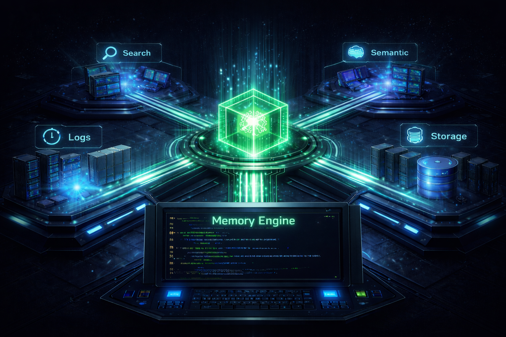

<p align="center">
  
</p>

<h1 align="center">Memory Engine</h1>

<p align="center"><strong>Persistent brain database for AI coding tools.</strong><br/>Indexes conversation history from Claude Code, Codex CLI, and Copilot CLI into searchable SQLite + vector embeddings with a live web dashboard.</p>

## Features

| Tab | Description |
|-----|-------------|
| **Search** | Full-text search (FTS5) across all conversations |
| **Timeline** | Daily activity stats, role breakdowns, 30-day chart |
| **Sessions** | Browse all indexed sessions with entry counts |
| **Topics** | Auto-discovered topics by mention frequency |
| **Projects** | User-created collections to group sessions |
| **Semantic** | Hybrid search (meaning + keyword) via Chroma embeddings |
| **Observations** | Auto-extracted knowledge: bugfixes, discoveries, patterns, decisions |
| **Live** | Real-time tail of active conversation |

## Architecture

```
JSONL (Claude Code conversations)
  │ auto_ingest.py
  ▼
SQLite (memory.db)
  ├── FTS5 full-text search
  ├── Observations extraction (pattern-based)
  ├── Session summaries
  ├── Projects / knowledge
  └──→ embed_batch.py
       │
       ▼
       Chroma (vector-db/)
       └── Hybrid search (semantic + keyword)
```

## Quick Start

### Windows
```cmd
git clone https://github.com/YOUR_USERNAME/claude-memory.git
cd claude-memory
setup.bat
```

### Linux / Mac
```bash
git clone https://github.com/YOUR_USERNAME/claude-memory.git
cd claude-memory
chmod +x setup.sh && ./setup.sh
```

### Manual Setup
```bash
pip install -r requirements.txt
python setup.py           # Initialize DB + configure Claude Code MCP
python memory_engine/auto_ingest.py all   # Ingest conversations
python memory_engine/api_server.py        # Start API server → http://localhost:37888
cd web && npm install && npm run dev      # Start dashboard → http://localhost:3000
```

## Components

### Core Engine (`memory_engine/`)
- `engine.py` — MemoryEngine class. SQLite operations, JSONL ingestion, FTS5, topics, projects
- `mcp_server.py` — FastMCP server (stdio). Exposes 40+ tools to Claude Code
- `api_server.py` — JSON API server on port 37888 (backend for the dashboard)
- `semantic.py` — SemanticEngine. Chroma embeddings, vector search, hybrid search
- `observations.py` — ObservationExtractor. Pattern-based knowledge extraction (references, decisions, bugfixes, etc.)
- `auto_ingest.py` — Background JSONL→SQLite ingestion with lockfile safety
- `embed_batch.py` — Memory-safe batch embedding (SQLite→Chroma)
- `cli.py` — CLI interface (ingest, export, status, config)
- `config.py` — Cross-platform path configuration

### Web Dashboard (`web/`)
Next.js app with dark theme. Features: live pulse, session browser with digest/summary panels, search, semantic search, observations, timeline, topics, projects, live view, setup wizard.

### MCI Hooks (`hooks/`)
Session lifecycle hooks for Claude Code:
- `mci-session-start.sh` — Creates state.md template, loads identity
- `mci-pre-compact.sh` — Snapshots state to .mci before auto-compact
- `mci-prompt-capture.sh` — Captures user prompts
- `mci-stop.sh` — Session cleanup and summary

### Agent Memory (`scripts/`)
- `agent-memory.sh` — Agent memory management
- `bootstrap-agent-memory.sh` — Bootstrap agent knowledge bases
- `register-agent.sh` — Register new agent types
- `topic-scanner.py` — Scan and index bounty programs

### Config Templates (`templates/`)
- `CLAUDE.md` — Session instructions and memory system docs
- `SOUL.md` — Identity definition
- `USER.md` — User preferences and output style

## Configuration

All paths are auto-detected. Override via environment variables:

| Variable | Default | Description |
|----------|---------|-------------|
| `MEMORY_DB` | `./memory.db` | SQLite database path |
| `MEMORY_CHROMA_PATH` | `~/.claude-mem/vector-db` | Chroma vector DB directory |
| `MEMORY_JSONL_DIR` | Auto-detected | Claude Code JSONL directory |
| `MEMORY_VIEWER_PORT` | `37888` | Viewer HTTP port |
| `MEMORY_ENGINE_DIR` | Script directory | Base directory for engine files |

## MCP Server

The engine runs as an MCP server that Claude Code connects to via stdio:

```json
{
  "mcpServers": {
    "memory-engine": {
      "command": "python",
      "args": ["path/to/memory_engine/mcp_server.py"],
      "env": {
        "MEMORY_DB": "path/to/memory.db"
      }
    }
  }
}
```

`setup.py` configures this automatically.

## Semantic Search (Optional)

For vector embeddings and hybrid search:

```bash
pip install chromadb
python memory_engine/embed_batch.py    # Initial embedding (may take a while)
```

## Observation Types

Auto-extracted from conversations:

| Type | Pattern |
|------|---------|
| `bugfix` | "fixed", "root cause was", "the issue was" |
| `discovery` | "found", "discovered", "[!]" markers |
| `feature` | "added", "implemented", "created" |
| `decision` | "let's use", "going with", "decided to" |
| `pattern` | "always", "pattern:", "whenever" |
| `change` | "updated", "changed", "refactored" |

## License

MIT License. See [LICENSE](LICENSE) for details.
